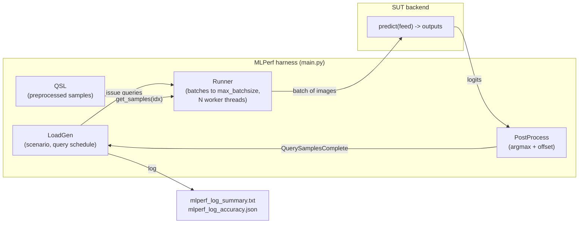

# Architecture

## What is (and isn't) MLPerf

> **Reminder:** this suite is **MLPerf-inspired, not conformant MLPerf** — short configs, subset
> datasets, and (for Whisper) not even LoadGen. See the table below. The description of MLPerf that
> follows is what a *real* submission does, for context.

**MLPerf Inference** (by MLCommons) benchmarks how fast a *system* (hardware + software) runs a
**fixed** model on **fixed** data to a **fixed** accuracy target. Because the model/dataset/quality
are fixed, the only variable is the system — which makes it a fair cross-vendor comparison. It has
two halves:

- **Performance** — throughput (Offline) or latency percentiles (SingleStream/Server). *This
  reflects the hardware.*
- **Accuracy** — must meet a quality gate (e.g. ResNet-50 ≥ 75.7% top-1). *This is a property of the
  model — nearly hardware-independent* (we measured identical f1 on the 5070 Ti and T4).

| Component | Uses MLCommons LoadGen? | Conformant MLPerf? |
|---|---|---|
| `reference/` — **BERT** | ✅ LoadGen | ❌ No — 60 s config, 1,000-example SQuAD subset |
| `reference/` — **ResNet-50** | ✅ LoadGen | ❌ No — 10 s config, Imagenette / 5k-image subset |
| `reference/` — **Whisper** | ❌ **No LoadGen** — custom sequential loop over ~30–100 files | ❌ No |
| `tensorrt/` — ResNet-50 + TensorRT SUT | ✅ LoadGen, custom backend | ❌ No — 10 s config, `min_query_count=1`, subset |
| `microbench/` — TFLOPS / bandwidth / throughput | ❌ No — homegrown timing loop | ❌ No |

### Why none of these are conformant MLPerf

[MLPerf Inference rules](https://github.com/mlcommons/inference_policies/blob/master/inference_rules.adoc)
require, per benchmark: runs of ~**600 s** minimum duration, **minimum query counts**, and an
**accuracy pass over the complete validation set** — plus compliance tests. They also restrict the
unqualified "MLPerf" name to conforming results. This suite deliberately uses **short configs and
subset datasets** for fast iteration on a laptop, so:

- It is **MLPerf-*inspired***, not MLPerf. Numbers must not be published under the MLPerf label.
- A LoadGen "**VALID**" line means the run satisfied *its own short config's* constraints (it ran
  longer than that config's `min_duration` with enough queries) — **not** MLPerf conformance.
- **Whisper is not even LoadGen-based**: the MLCommons Whisper reference SUT uses vLLM (heavy,
  Blackwell-risky), so we substituted a plain `openai-whisper` loop with the same model and WER
  metric. It is a *reimplementation of the workload*, not the reference harness.

The MLPerf **reference** backends are also explicitly *not* optimized (their own README says so) —
they define the benchmark, they don't set hardware records. `tensorrt/` adds an optimized backend
under LoadGen, but is still a *reference-grade SUT* run under a short config, not a submission.

## How LoadGen drives a benchmark

- **LoadGen** decides *which* samples to send and *when*, per the scenario:
  - **Offline** — one big coalesced query → measures **throughput** (samples/sec).
  - **SingleStream** — one sample at a time → measures **latency percentiles** (p50/p90/p99).
  - **Server** — Poisson arrivals at a target QPS under a p99 latency bound.
- **QSL** holds the preprocessed dataset (images resized/normalized to NCHW fp).
- The **Runner** chunks each query into `max_batchsize` batches and calls the SUT from *N worker
  threads* (Offline uses `os.cpu_count()` threads).
- The **SUT backend** implements `predict(feed) -> [output_batch]`. Post-processing does the argmax.
- Results: `mlperf_log_summary.txt` (VALID/INVALID + metric) and `mlperf_log_accuracy.json`.

## The TensorRT backend (`tensorrt/backend_tensorrt.py`)

Implements the harness `Backend` interface (`version/name/image_format/load/predict`):

- **`load()`** — parses an **fp16 ONNX** into a TensorRT **strongly-typed** network (TRT ≥10 infers
  precision from the ONNX dtypes; there is no `BuilderFlag.FP16` anymore), with a **dynamic-batch
  optimization profile** `(1 … TRT_MAX_BATCHSIZE)` so one engine handles SingleStream (batch 1) and
  Offline (batches up to `max_batchsize`). Allocates reusable max-size fp16 device buffers, sets
  tensor addresses, and **warms up** (avoids a first-query latency outlier).
- **`predict()`** — copies the numpy batch → device buffer, `set_input_shape` to the real batch,
  `execute_async_v3`, sync, returns `[logits.cpu().numpy()]`. Wrapped in a **`threading.Lock`**
  because MLPerf's QueueRunner calls it from many threads and **TRT execution contexts are not
  thread-safe** (without the lock: segfault).

Registered by adding an `elif backend == "tensorrt":` branch to `main.py`'s `get_backend()`
(the run script patches this idempotently). It uses the `resnet50-pytorch` profile → the
`imagenet_pytorch` dataset with `PostProcessArgMax(offset=0)`, which is self-consistent with a
torchvision (1000-class, 0-indexed) model.

### Why the Offline number is host-bound, not GPU-bound

This SUT does a numpy→torch H2D copy and a D2H→numpy copy **per query**, serialized by the lock.
That host plumbing — not the GPU — is the bottleneck: Offline throughput barely moved when
`max_batchsize` went 32→128 (3,325 → 3,112 img/s on the 5070 Ti), while the raw microbench (no
per-query numpy roundtrip) hits 4,774. A submission-grade SUT closes the gap with pinned memory,
async I/O, and keeping tensors resident on the GPU.

## The microbenchmark (`microbench/gpu_bench.py`)

Not MLPerf — a direct timing loop measuring:
- **Peak matmul TFLOPS** (fp32 / tf32 / fp16 / bf16) over a matrix-size sweep.
- **Memory bandwidth** via a large device-to-device copy.
- **ResNet-50 fp16 throughput** over a batch sweep, in three tiers: **eager**, **`torch.compile`**
  (`reduce-overhead` / cudagraphs), and **TensorRT** (same strongly-typed fp16 engine as above).

Reports the peak per metric plus the per-size/per-batch curve. `cpu_bench.py` is the CPU analogue.

## Hardware notes

- **RTX 5070 Ti Laptop (sm_120, Blackwell)** — needs torch **cu128**. Its fused-SDPA attention
  kernel is broken (see [gotchas.md](gotchas.md)); conv/matmul are fine.
- **Colab T4 (sm_75, Turing)** — no TF32 and no BF16 tensor cores (those fall back to slow paths).
- **A100 (sm_80) / H200 (sm_90)** — fully supported by torch cu128 + TensorRT 11; need large
  batch/matrix sweeps to reach peak.
