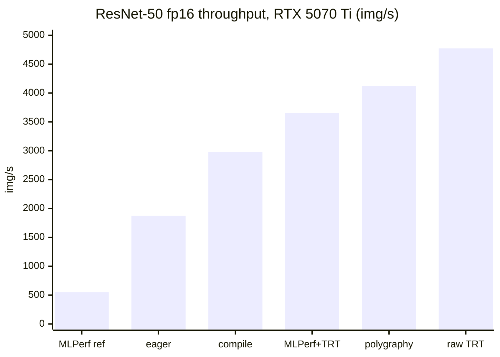

# Results

> ## ⚠️ Unofficial, MLPerf-*inspired* smoke tests — NOT conformant MLPerf
>
> These numbers come from **short, non-conformant configs** (10–60 s vs MLPerf's ~600 s) on **subset
> datasets** (Imagenette / a 5,000-image ImageNet mirror / 1,000 SQuAD examples), and **Whisper does
> not use LoadGen at all** (custom loop). A LoadGen "VALID" line here means the run met *its own short
> config*, not MLPerf conformance. **Do not report these under the MLPerf label or use them for
> procurement.** Background: [architecture.md](architecture.md#what-is-and-isnt-mlperf).
>
> They are also **point-in-time** numbers; bundles that back the "bundle-backed" rows are gitignored
> (see [Provenance & caveats](#provenance--caveats) at the bottom) — laptop figures vary ±10% run-to-run.

All numbers measured with torch **2.11.0+cu128**, TensorRT **11.1**. Laptop 5070 Ti figures vary
±10% run-to-run (thermal throttling); datacenter/Colab figures are stable.

## Hardware

| GPU | Arch | VRAM | SMs | Notes |
|---|---|---|---|---|
| RTX 5070 Ti Laptop | Blackwell sm_120 | 12.8 GB | 46 | thermally limited (laptop) |
| Colab T4 | Turing sm_75 | 16 GB | 40 | no TF32/BF16 tensor cores |
| CPU: Intel Core Ultra 9 275HX | — | — | 24 threads | |

---

## Visual summary

### ResNet-50 fp16 throughput on the RTX 5070 Ti — reference → optimized → raw



Same model, same GPU — 8.6× from the unoptimized MLPerf reference (552) to a raw TensorRT engine
(4,774). The MLPerf+TensorRT harness (3,652) trails raw TRT because its SUT is host-bound.

```text
ResNet-50 fp16 throughput (img/s), RTX 5070 Ti
  MLPerf reference ███                          552
  eager PyTorch    ███████████                  1,873
  torch.compile    █████████████████            2,982
  MLPerf+TensorRT  █████████████████████        3,652
  polygraphy       ████████████████████████     4,125
  raw TensorRT     ████████████████████████████ 4,774
```

### RTX 5070 Ti vs Colab T4

```text
ResNet-50 fp16, raw TensorRT (img/s)
  5070 Ti  ████████████████████████████ 4,774
  T4       ███████████                  1,945 (2.5x)

FP16 tensor-core TFLOPS
  5070 Ti  ████████████████████████████ 42.7
  T4       ███████████████              22.7 (1.9x)

Memory bandwidth (GB/s)
  5070 Ti  ████████████████████████████ 498
  T4       █████████████                232 (2.1x)

MLPerf TensorRT SingleStream p90 latency (ms, lower=better)
  5070 Ti  ████████████████████████████ 4.2 (laptop, noisy)
  T4       ███████████████████          2.8 (stable clock wins at batch-1)
```

### GPU vs CPU — the reason inference runs on GPUs

```text
llama.cpp TinyLlama-1.1B decode (tokens/s), 5070 Ti
  GPU  ████████████████████████████ 463
  CPU  ██                           27  (17x; prefill 19,082 vs 410 = 47x)

ResNet-50 (img/s), 5070 Ti TensorRT vs 24-thread CPU
  GPU  ████████████████████████████ 4,774
  CPU                               27  (~175x)
```

---

## MLPerf-*inspired* reference runs (BERT/ResNet = LoadGen on subsets; Whisper = custom loop)

| Domain | Model / dataset | Harness | Metric | RTX 5070 Ti | Colab T4 |
|---|---|---|---|---|---|
| NLP | BERT-Large / SQuAD v1.1 (1k subset) | LoadGen | f1 (Offline) | **90.40** | **90.40** |
| | | | throughput | 25.7 samples/s | 10.9 samples/s |
| Vision | ResNet-50 / ImageNet (subset) | LoadGen | top-1 (Imagenette) | 84.5% | 84.6% |
| | | | top-1 (repr. 1000-class, 5k) | 75.4% | — |
| | | | throughput (Offline) | 552 samples/s | 304 samples/s |
| Speech | whisper-large-v3 / LibriSpeech (~30–100 utt) | **custom loop, no LoadGen** | WER (dev-clean) | 3.6–5.0% | 2.16% |
| | | | RTF | ~0.16 | ~0.31 |

CPU (5070 Ti host, reference): BERT f1 88.74 @ 1.37 samples/s.
Accuracy is essentially hardware-independent (f1 90.40 identical across GPUs); throughput is the
hardware signal.

---

## LoadGen + TensorRT ResNet-50 (fp16) — LoadGen-VALID under this suite's short config (not MLPerf-conformant)

| Scenario | Metric | RTX 5070 Ti | Colab T4 |
|---|---|---|---|
| SingleStream | **p90 latency** | **2.39 ms** (VALID)‡ | **2.80 ms** |
| | QPS (batch-1) | 561 | — |
| Offline | **throughput** | **3,652 img/s** (VALID)‡ | 1,200 img/s |
| Accuracy | top-1 | 75.44% (repr, 5k) / 84.5% (Imagenette) | 84.6% (Imagenette) |

‡ 5070 Ti figures are from a bundle-backed run (`results/bundles/…-trt-5070ti-retune`, all three
scenarios LoadGen-VALID, `INFERENCE_REF=da738a5`, `MAXBS=128`). Earlier laptop SingleStream runs
were noisy/INVALID at `min_query_count=4000` (the card now does ~580 QPS, so 4000 queries finished in
~7 s < the 10 s min-duration); bumping to 12000 makes it VALID — see [gotchas.md](gotchas.md).

**Findings.** The T4 has *lower, cleaner* single-stream latency (stable clock beats a throttling
laptop at batch-1, where the workload is latency/host-bound). The 5070 Ti has ~2.7× the Offline
throughput (sustained compute wins). `max_batchsize` 32→128 did **not** help (host-bound SUT).

---

## Microbenchmarks (custom, not MLPerf)

### GPU

| Metric | RTX 5070 Ti | Colab T4 |
|---|---|---|
| FP32 TFLOPS | 11.8 | 3.9 |
| TF32 TFLOPS | 20.4 | 3.9¹ |
| FP16 TFLOPS | 42.7 | 22.7 |
| BF16 TFLOPS | 51.4 | 2.1² |
| Memory bandwidth | 498 GB/s | 232 GB/s |
| ResNet-50 fp16 — eager | 1,873 img/s | 1,069 |
| ResNet-50 fp16 — torch.compile | 2,982 img/s | 1,519 |
| ResNet-50 fp16 — **TensorRT** | **4,774 img/s** | **1,945** |

¹ Turing has no TF32 tensor cores (TF32 == FP32). ² Turing has no BF16 tensor cores (slow fallback).

### CPU — Intel Core Ultra 9 275HX (24 threads)

| Metric | Value |
|---|---|
| FP32 GFLOPS | 638 |
| BF16 GFLOPS | 1,309 |
| Memory bandwidth | 51 GB/s |
| ResNet-50 fp32 | 20.8 img/s |
| ResNet-50 torch.compile | 27.2 img/s |

The GPU (TensorRT) is **~175×** the CPU on ResNet-50 — why inference runs on GPUs.

---

## Other standards (`standards/`)

| Benchmark | Metric | RTX 5070 Ti | Colab T4 |
|---|---|---|---|
| Polygraphy (trtexec equiv) — ResNet-50 fp16 bs128 | throughput | ~4,125 img/s | — |
| llama.cpp llama-bench — TinyLlama-1.1B Q4, **GPU** | prefill / decode | 20,842 / 434 t/s‡ | N/A† |
| llama.cpp llama-bench — TinyLlama-1.1B Q4, **CPU** (24t) | prefill / decode | 410 / 27.2 t/s | — |
| AI-Benchmark (ETH) | AI Score | run on T4/CPU (TF ≠ Blackwell) | |
| MLPerf Client | tokens/s, TTFT | native-Windows app (see doc) | |

GPU vs CPU on the LLM (5070 Ti): ~51× prefill, ~16× decode.

‡ Bundle-backed run, SHA-256-verified model, arch auto-detected `120 → 120a` (Blackwell). Prefill is
noisy (±~3,700 t/s ≈ 17% run-to-run); decode stable (±43). An earlier run measured 19,082 / 463.

† **T4 llama-bench GPU: not obtained on free Colab.** Free Colab T4 VMs have only **2 vCPUs**;
llama.cpp's CUDA build (many flash-attention / kernel template instances) doesn't finish within the
session lifetime, even with `-DGGML_CUDA_FORCE_CUBLAS=ON` and pinned `sm_75`. Get it on Colab Pro
(more vCPUs) or a real T4 box, or use a prebuilt CUDA binary.

## Reference vs optimized vs raw (ResNet-50, 5070 Ti)

| Path | img/s | What it measures |
|---|---|---|
| MLPerf reference (PyTorch) | 552 | unoptimized reference harness |
| LoadGen + TensorRT (this suite) | ~3,652 | LoadGen + optimized backend (short config) |
| Raw microbench (TensorRT) | 4,774 | GPU ceiling, no harness/host overhead |

The gap between the middle and bottom rows is the reference-grade SUT's host overhead
(per-query numpy copies + lock), not the GPU — see [architecture.md](architecture.md).

---

## Provenance & caveats

Read this before trusting any number above.

- **Point-in-time, mostly not committed as artifacts.** These were recorded across several sessions
  on a thermally variable laptop and a shared Colab T4. The 5070 Ti figures marked "bundle-backed"
  (LoadGen+TensorRT, polygraphy, llama-bench) were verified against a `scripts/run_bundle.sh` bundle
  on the author's machine, but **bundles are gitignored**, so a reader can't independently check them
  unless one is published (`git add -f` or a release). The rest are older point-in-time numbers.
  Prefer regenerating a bundle over citing this table.
- **The checked-in notebooks are not the source of every number.** Some notebook cells were re-run
  out of band, some `*_output.ipynb` performance/accuracy cells are empty, and a few figures come
  from later/cached runs. Concretely: the reference ResNet Offline figure is quoted as **552**
  (a later run) while one checked-in notebook cell shows **472**; both are the same unoptimized
  reference path on the 5070 Ti and differ within the ±10% laptop spread. Treat single-run numbers
  as approximate.
- **Subsets, not full validation sets.** Accuracy (top-1, f1, WER) is over small subsets, so it is
  only a sanity indicator, not a conformant accuracy result.
- **How to reproduce cleanly:** run the script under `scripts/run_bundle.sh` (see
  [user-guide.md](user-guide.md)), which pins versions, checksums assets, captures the full
  environment, and writes a parsed result alongside the raw logs. That bundle — not this table — is
  the citable artifact.

## Pending

- **A100 (sm_80) / H200 (sm_90)** — run `microbench/gpu_bench.py` (with a large sweep) and/or
  `tensorrt/trt_mlperf_run.sh` on the work boxes (or a Brev cloud instance) and paste the JSON.
  The scripts are portable to native Linux — hand off with [../HANDOFF.md](../HANDOFF.md).
- **Work-machine CPUs** — `microbench/cpu_bench.py`.
