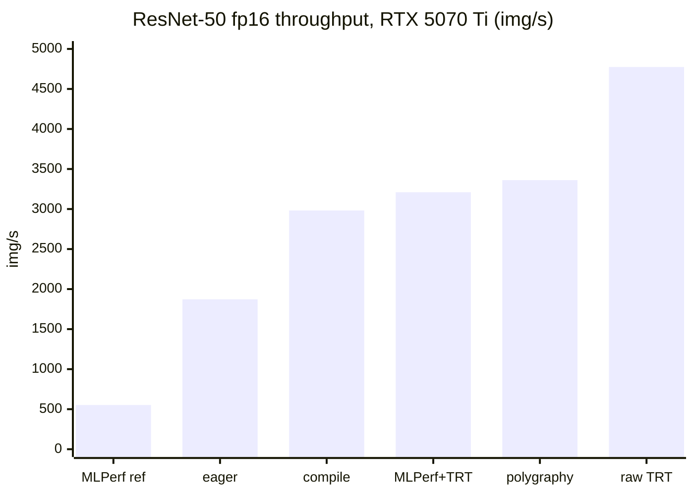

# Results

> ## ⚠️ Unofficial, MLPerf-*inspired* smoke tests — NOT conformant MLPerf
>
> These numbers come from **short, non-conformant configs** (10–60 s vs MLPerf's ~600 s) on **subset
> datasets** (Imagenette / a 5,000-image ImageNet mirror / 1,000 SQuAD examples), and **Whisper does
> not use LoadGen at all** (custom loop). A LoadGen "VALID" line here means the run met *its own short
> config*, not MLPerf conformance. **Do not report these under the MLPerf label or use them for
> procurement.** Background: [architecture.md](architecture.md#what-is-and-isnt-mlperf).
>
> They are also **point-in-time** numbers (see [Provenance & caveats](#provenance--caveats) at the
> bottom) — laptop figures vary **±15–20%** run-to-run with thermal state, and SingleStream latency
> more (a hot session measured p90 4.6–7.7 ms). The three committed 5070 Ti bundles came from a hot
> session and sit at the low end of that spread.

All numbers measured with torch **2.11.0+cu128**, TensorRT **11.1**. Laptop 5070 Ti figures vary
**±15–20%** run-to-run (thermal throttling), single-stream latency more; datacenter/Colab figures are stable.

## Hardware

| GPU | Arch | VRAM | SMs | Notes |
|---|---|---|---|---|
| RTX 5070 Ti Laptop | Blackwell sm_120 | 12.8 GB | 46 | thermally limited (laptop) |
| Colab T4 | Turing sm_75 | 16 GB | 40 | no TF32/BF16 tensor cores |
| CPU: Intel Core Ultra 9 275HX | — | — | 24 threads | |

---

## Visual summary

### ResNet-50 fp16 throughput on the RTX 5070 Ti — reference → optimized → raw



Same model, same GPU — ~8.6× from the unoptimized MLPerf reference (552) to a raw TensorRT engine.
The MLPerf+TensorRT harness (3,210) trails polygraphy (3,361) and raw TRT because its SUT is
host-bound. **Caveat:** `MLPerf+TRT` and `polygraphy` are today's committed-bundle numbers on a
thermally throttled laptop; `eager`/`compile`/`raw TRT` are from an earlier cooler microbench session
(raw TRT would also be lower today), so read the gaps as approximate.

```text
ResNet-50 fp16 throughput (img/s), RTX 5070 Ti
  MLPerf reference ███                          552
  eager PyTorch    ███████████                  1,873
  torch.compile    █████████████████            2,982
  MLPerf+TensorRT  ███████████████████          3,210
  polygraphy       ████████████████████         3,361
  raw TensorRT     ████████████████████████████ 4,774
```

### RTX 5070 Ti vs Colab T4

```text
ResNet-50 fp16, raw TensorRT (img/s)
  5070 Ti  ████████████████████████████ 4,774
  T4       ███████████                  1,945 (2.5x)

FP16 tensor-core TFLOPS
  5070 Ti  ████████████████████████████ 42.7
  T4       ███████████████              22.7 (1.9x)

Memory bandwidth (GB/s)
  5070 Ti  ████████████████████████████ 498
  T4       █████████████                232 (2.1x)

MLPerf TensorRT SingleStream p90 latency (ms, lower=better)
  5070 Ti  ████████████████████████████ ~5.5 (laptop, thermal-noisy: 4.6–7.7 across runs)
  T4       ██████████████               2.8 (stable clock wins at batch-1)
```

### GPU vs CPU — the reason inference runs on GPUs

```text
llama.cpp TinyLlama-1.1B decode (tokens/s), 5070 Ti
  GPU  ████████████████████████████ 313
  CPU  ██                           27  (12x; prefill 17,693 vs 410 = 43x)

ResNet-50 (img/s), 5070 Ti TensorRT vs 24-thread CPU
  GPU  ████████████████████████████ 4,774
  CPU                               27  (~175x)
```

---

## MLPerf-*inspired* reference runs (BERT/ResNet = LoadGen on subsets; Whisper = custom loop)

| Domain | Model / dataset | Harness | Metric | RTX 5070 Ti | Colab T4 |
|---|---|---|---|---|---|
| NLP | BERT-Large / SQuAD v1.1 (1k subset) | LoadGen | f1 (Offline) | **90.40** | **90.40** |
| | | | throughput | 25.7 samples/s | 10.9 samples/s |
| Vision | ResNet-50 / ImageNet (subset) | LoadGen | top-1 (Imagenette) | 84.5% | 84.6% |
| | | | top-1 (repr. 1000-class, 5k) | 75.4% | — |
| | | | throughput (Offline) | 552 samples/s | 304 samples/s |
| Speech | whisper-large-v3 / LibriSpeech (~30–100 utt) | **custom loop, no LoadGen** | WER (dev-clean) | 3.6–5.0% | 2.16% |
| | | | RTF | ~0.16 | ~0.31 |

CPU (5070 Ti host, reference): BERT f1 88.74 @ 1.37 samples/s.
Accuracy is essentially hardware-independent (f1 90.40 identical across GPUs); throughput is the
hardware signal.

---

## LoadGen + TensorRT ResNet-50 (fp16) — LoadGen-VALID under this suite's short config (not MLPerf-conformant)

| Scenario | Metric | RTX 5070 Ti | Colab T4 |
|---|---|---|---|
| SingleStream | **p90 latency** | **5.49 ms** (VALID)‡ — laptop-thermal-noisy | **2.80 ms** |
| | QPS (batch-1) | 320 | — |
| Offline | **throughput** | **3,210 img/s** (VALID)‡ | 1,200 img/s |
| Accuracy | top-1 | 75.34% (repr, 5k) / 84.5% (Imagenette) | 84.6% (Imagenette) |

‡ 5070 Ti figures are from a **committed** bundle
(`results/bundles/20260719T122957Z-trt-5070ti-hardened.BnXBbN/`, `repo_commit` clean at `2a9f779`,
all three scenarios LoadGen-VALID, `INFERENCE_REF=da738a5`, `MIN_SAMPLES=5000 MIN_CLASSES=1000`) — so
a reader can check the raw logs, not just this table. **SingleStream p90 is thermally noisy on this
laptop**: three back-to-back runs gave 4.62 / 5.49 / 7.72 ms (QPS 342 / 320 / 231). Treat it as
indicative, not a stable figure; Offline throughput (3,152 / 3,210 / 3,191 img/s) is the stable
signal. Earlier runs were also INVALID at `min_query_count=4000` (finished in ~7 s < the 10 s
min-duration); 12000 makes it VALID — see [gotchas.md](gotchas.md).

**Findings.** The T4 has *lower, cleaner* single-stream latency (stable clock beats a throttling
laptop at batch-1, where the workload is latency/host-bound). The 5070 Ti has ~2.7× the Offline
throughput (sustained compute wins). `max_batchsize` 32→128 did **not** help (host-bound SUT).

---

## Microbenchmarks (custom, not MLPerf)

### GPU

| Metric | RTX 5070 Ti | Colab T4 |
|---|---|---|
| FP32 TFLOPS | 11.8 | 3.9 |
| TF32 TFLOPS | 20.4 | 3.9¹ |
| FP16 TFLOPS | 42.7 | 22.7 |
| BF16 TFLOPS | 51.4 | 2.1² |
| Memory bandwidth | 498 GB/s | 232 GB/s |
| ResNet-50 fp16 — eager | 1,873 img/s | 1,069 |
| ResNet-50 fp16 — torch.compile | 2,982 img/s | 1,519 |
| ResNet-50 fp16 — **TensorRT** | **4,774 img/s** | **1,945** |

¹ Turing has no TF32 tensor cores (TF32 == FP32). ² Turing has no BF16 tensor cores (slow fallback).

### CPU — Intel Core Ultra 9 275HX (24 threads)

| Metric | Value |
|---|---|
| FP32 GFLOPS | 638 |
| BF16 GFLOPS | 1,309 |
| Memory bandwidth | 51 GB/s |
| ResNet-50 fp32 | 20.8 img/s |
| ResNet-50 torch.compile | 27.2 img/s |

The GPU (TensorRT) is **~175×** the CPU on ResNet-50 — why inference runs on GPUs.

---

## Other standards (`standards/`)

| Benchmark | Metric | RTX 5070 Ti | Colab T4 |
|---|---|---|---|
| Polygraphy (trtexec equiv) — ResNet-50 fp16 bs128 | throughput | ~3,361 img/s‡ | — |
| llama.cpp llama-bench — TinyLlama-1.1B Q4, **GPU** | prefill / decode | 17,693 / 313 t/s‡ | N/A† |
| llama.cpp llama-bench — TinyLlama-1.1B Q4, **CPU** (24t) | prefill / decode | 410 / 27.2 t/s | — |
| AI-Benchmark (ETH) | AI Score | run on T4/CPU (TF ≠ Blackwell) | |
| MLPerf Client | tokens/s, TTFT | native-Windows app (see doc) | |

GPU vs CPU on the LLM (5070 Ti): ~43× prefill, ~12× decode.

‡ **Committed** bundles (a reader can check the raw logs):
`results/bundles/20260719T131317Z-llama-5070ti-b10068.TLuwNJ/` (llama-bench, model SHA-256-verified,
pinned `LLAMA_REF=b10068`, arch auto-detected `120`) and
`results/bundles/20260719T131444Z-polygraphy-5070ti.HgydkD/` (polygraphy) — both `repo_dirty: no`.
These were measured in a **thermally throttled** session; cooler earlier runs of the same benchmarks
were higher (llama prefill/decode ~19–21k / ~434–463 t/s, polygraphy ~4,125 img/s), so treat these as
the checkable low end of a ±15–20% laptop spread. llama prefill is also inherently noisy (±~2,000 t/s).

† **T4 llama-bench GPU: not obtained on free Colab.** Free Colab T4 VMs have only **2 vCPUs**;
llama.cpp's CUDA build (many flash-attention / kernel template instances) doesn't finish within the
session lifetime, even with `-DGGML_CUDA_FORCE_CUBLAS=ON` and pinned `sm_75`. Get it on Colab Pro
(more vCPUs) or a real T4 box, or use a prebuilt CUDA binary.

## Reference vs optimized vs raw (ResNet-50, 5070 Ti)

| Path | img/s | What it measures |
|---|---|---|
| MLPerf reference (PyTorch) | 552 | unoptimized reference harness |
| LoadGen + TensorRT (this suite) | ~3,210 | LoadGen + optimized backend (short config) |
| Raw microbench (TensorRT) | 4,774 | GPU ceiling, no harness/host overhead |

The gap between the middle and bottom rows is the reference-grade SUT's host overhead
(per-query numpy copies + lock), not the GPU — see [architecture.md](architecture.md).

---

## Provenance & caveats

Read this before trusting any number above.

- **Point-in-time; the three 5070 Ti optimized runs are committed as bundles.** These were recorded
  across several sessions on a thermally variable laptop and a shared Colab T4. The LoadGen+TensorRT,
  polygraphy, and llama-bench (@ b10068) runs are each backed by a **committed** bundle under
  `results/bundles/…` (force-added past the `.gitignore`, all `repo_dirty: no`) so a reader can check
  the raw logs, env, and asset hashes. The committed 5070 Ti figures came from a **thermally
  throttled** session and sit at the low end of the ±15–20% laptop spread (earlier cooler runs were
  higher — noted inline). The microbench (eager/compile/raw-TRT) and Colab figures are older
  point-in-time numbers — prefer regenerating a bundle over citing this table.
- **The checked-in notebooks are not the source of every number.** Some notebook cells were re-run
  out of band, some `*_output.ipynb` performance/accuracy cells are empty, and a few figures come
  from later/cached runs. Concretely: the reference ResNet Offline figure is quoted as **552**
  (a later run) while one checked-in notebook cell shows **472**; both are the same unoptimized
  reference path on the 5070 Ti and differ within the ±15–20% laptop spread. Treat single-run numbers
  as approximate.
- **Subsets, not full validation sets.** Accuracy (top-1, f1, WER) is over small subsets, so it is
  only a sanity indicator, not a conformant accuracy result.
- **How to reproduce cleanly:** run the script under `scripts/run_bundle.sh` (see
  [user-guide.md](user-guide.md)), which pins versions, checksums assets (incl. a root hash over
  every val image), and captures the env knobs plus a full `pip freeze` alongside the raw logs. That
  bundle — not this table — is the citable artifact.

## Pending

- **A100 (sm_80) / H200 (sm_90)** — run `microbench/gpu_bench.py` (with a large sweep) and/or
  `tensorrt/trt_mlperf_run.sh` on the work boxes (or a Brev cloud instance) and paste the JSON.
  The scripts are portable to native Linux — hand off with [../HANDOFF.md](../HANDOFF.md).
- **Work-machine CPUs** — `microbench/cpu_bench.py`.
